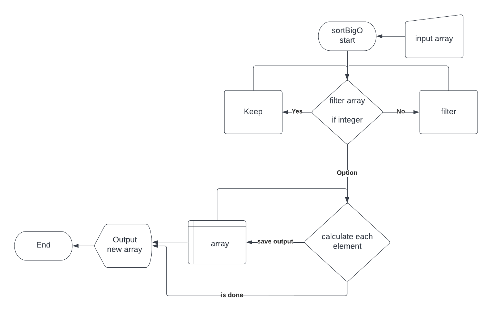

# Fra tekst til kode
En opgave i matematisk modellering af en problemstilling fra koncept til færdig kode. 

**Opgavebeskrivelsen**
* Beskriv et problem i selv finder på der skal løses - kan gøres i README.md	
* Opstil løsningen i trin - kan gøres i README.md	
* Tegn løsningen ind i et flowchart - i kan evt. bruge lucidchart (opret jer med skolemail)	
* Skriv løsningen i pseudokode - kan gøres i README.md	
* Skriv løsningen i javaScript og test at det virker	
* Commit løsningen til et public repository på github 	
* Svar på denne post med et link til repository med løsningen. 

## Problemstilling
Jeg er nysgerrig på hvor mange operationer det tager for at sortere mine arrays med `.sort()` method i javaScipt alt efter hvor mange input der er.

### Løsningen trin for trin
1. Find big O notation (tidskompleksitets formlen) for `.sort()` : O(n log(n)) - [Liste over big O notations for JS array methods](https://dev.to/lukocastillo/time-complexity-big-0-for-javascript-array-methods-and-examples-mlg)
2. Lav en funktion der tager et array som input
3. Filtrér gennem array så der kun er tal elementer i arrayet
4. For hvert element beregn n*log(n) 
5. Output er det resulterende array

### Løsningen i pseudokode
```
function sortBigO (array)
    filter array => accept only numbers

    for index = 0 index < array index++
        array[index] = array[index] * log(array[index])
    outout console log of new array
```

Her er valgt at bruge en for loop direkte men denne ville blive erstattet af en `.map()` i alle henseende med moderne Javascript (se nedenfor). Begge løsninger vil blive illustreret. 

```
function sortBigO (array)
    output console log of the result of:

    filter array => accept only numbers
    map array with the calculation of item * log(item)

```

### Løsningen i flow chart


### Løsningen i JavaScript
[Se i Script filen](script.js)